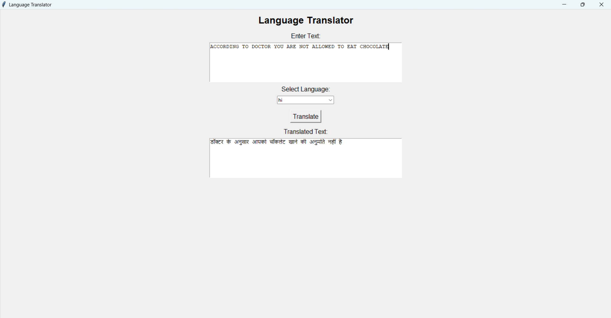

# CodeAlpha Language Translator

## Project Description

This project is a Language Translation Tool developed using Python.

The application accepts text from the user, allows selection of a target language, and translates the text into the chosen language using the Deep Translator library.

## Technologies Used

- Python
- Tkinter
- Deep Translator

## Features

- User-friendly GUI
- Translate text into multiple languages
- Fast and accurate translation
- Interactive desktop application

## How It Works

1. User enters text.
2. User selects a target language.
3. Clicks the Translate button.
4. The application sends the text to Deep Translator.
5. The translated text is displayed on the screen.

## Screenshot



## Installation

Install required library:

```bash
pip install deep-translator
```

Run:

```bash
python translator.py
```

## Author

Umika Thakur
